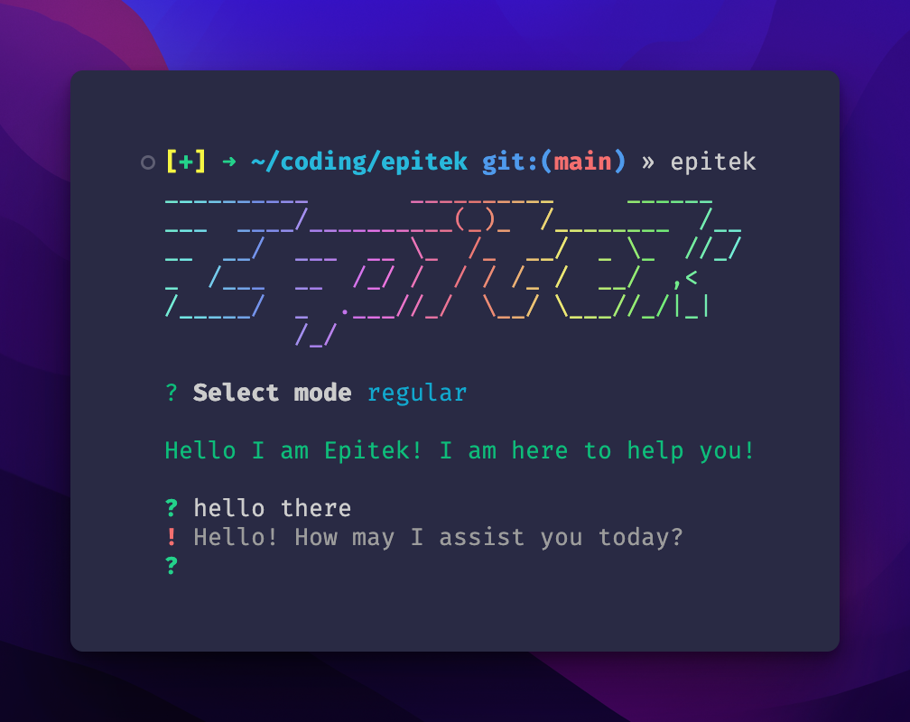

This is a simple cli tool to access the Chat GPT api.

# Installation

1. Clone repo
2. In repo: `npm install`
3. In repo: `npm install -g .`
4. Make sure you're using a recent nodejs version (>= 18 def works) (Use [nvm](https://github.com/nvm-sh/nvm) to manage node versions. It's great)
5. Copy the `.env.example` to `.env` and fill your openai api key
6. Star the repo if you like it :)

If this doesn't work and you're not being bad, please open an issue or [DM](https://twitter.com/ThomasForbesy) me.

# Roadmap

- [x] basic stuff
- [ ] dedicated settings file (for modes)
- [ ] put on npm
- [ ] better error handling

# Support Me

<link href="https://fonts.googleapis.com/css?family=Cookie" rel="stylesheet"><a class="bmc-button" target="_blank" href="https://www.buymeacoffee.com/thomasforbes">Buy me a Croissant</a>

